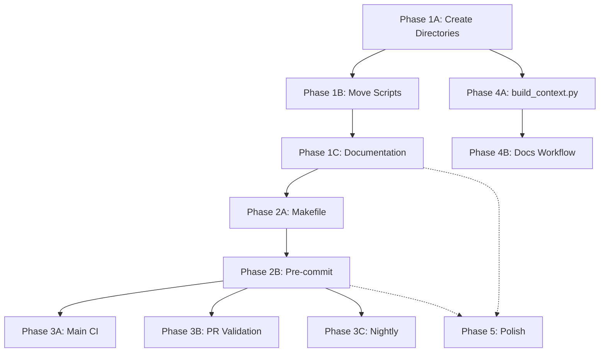

# Task Breakdown - Python Template Adoption

This document breaks down the adoption plan into specific, agent-runnable tasks with clear dependencies.

## Task Execution Guide

**Notation:**

- ✅ Can run in parallel with other tasks in same group
- 🔗 Must run serially (depends on previous tasks)
- ⚡ Quick task (<30 min)
- ⏱️ Medium task (30min - 2hr)
- 🕐 Long task (>2hr)

---

## PHASE 1: Foundation & Organization (CRITICAL)

### Group 1A: Directory Structure Creation ✅ PARALLEL

All tasks in this group can run simultaneously.

#### Task 1.1.1: Create agent-tmp Directory ⚡

**Executor:** File System Agent
**Effort:** 5 minutes
**Dependencies:** None
**Parallelizable:** Yes

**Actions:**

```bash
mkdir -p agent-tmp
```

**Create:** `agent-tmp/README.md`

```markdown
# Agent Temporary Files

This directory is for temporary outputs from AI agents including:

- Debug scripts and analysis
- Work-in-progress experiments
- Intermediate processing outputs
- Ad-hoc reports and summaries

## Automatic Cleanup

Files in this directory are automatically cleaned up after **7 days** by:

- The `make clean` command
- The `tools/build_context.py` script
- The nightly documentation workflow

## Best Practices

**Use this directory for:**

- Quick debugging scripts
- Exploratory data analysis
- Temporary experiment code
- Draft documentation before moving to permanent location

**Do NOT use this directory for:**

- Permanent documentation (use `docs/`)
- Active project plans (use `agent-projects/`)
- Production code (use `src/`)
- Test files (use `tests/`)

## Note

This directory is gitignored. Nothing here will be committed to version control.
```

**Validation:** Directory exists with README.md

---

#### Task 1.1.2: Create agent-projects Directory ⚡

**Executor:** File System Agent
**Effort:** 10 minutes
**Dependencies:** None
**Parallelizable:** Yes

**Actions:**

```bash
mkdir -p agent-projects
```

**Create:** `agent-projects/README.md`

```markdown
# Active Agent Projects

This directory contains active project folders for ongoing development initiatives managed by AI agents.

## Structure

Each project should be in its own subdirectory with:
```

agent-projects/
├── project-name/
│ ├── plan.md # Required: Project plan with YAML frontmatter
│ ├── notes.md # Optional: Implementation notes
│ ├── decisions.md # Optional: Design decisions
│ └── ... # Other project-specific files

````

## Plan.md Format

Each project's `plan.md` must include YAML frontmatter:

```yaml
---
status: active|completed|paused|abandoned
owner: AI Agent Name or Human Developer
created: YYYY-MM-DD
updated: YYYY-MM-DD
priority: high|medium|low
---

# Project Title

## Objective
[Clear statement of what this project aims to achieve]

## Status
[Current state and progress]

## Tasks
- [x] Completed task
- [ ] Pending task

## Notes
[Additional context, decisions, blockers]
````

## Lifecycle

1. **Active**: Projects less than 21 days old with status "active"
2. **Archived**: Move completed projects to `docs/archived-projects/`
3. **Context Generation**: Active plans are included in CONTEXT.md for AI agents

## Best Practices

- Update `plan.md` regularly with progress
- Keep plans focused and scoped appropriately
- Move to `docs/` when complete
- Use `agent-tmp/` for temporary exploration before creating a formal project

````

**Validation:** Directory exists with README.md

---

#### Task 1.1.3: Create tools Directory ⚡
**Executor:** File System Agent
**Effort:** 10 minutes
**Dependencies:** None
**Parallelizable:** Yes

**Actions:**
```bash
mkdir -p tools
````

**Create:** `tools/README.md`

````markdown
# Utility Tools

This directory contains utility scripts for development, testing, and automation.

## Available Tools

### validate_api.py

Validates LLM API connectivity and configuration.

**Usage:**

```bash
python tools/validate_api.py
```
````

### test_connectivity.py

Tests network connectivity to various services.

**Usage:**

```bash
python tools/test_connectivity.py
```

### kloc_report.py

Generates lines-of-code reports for the project.

**Usage:**

```bash
python tools/kloc_report.py
```

### configure_mem0.py

Configures Mem0 memory system for CrewAI agents.

**Usage:**

```bash
python tools/configure_mem0.py
```

## Adding New Tools

When adding new utility scripts:

1. Place in this `tools/` directory
2. Add appropriate shebang (`#!/usr/bin/env python3`)
3. Include comprehensive docstring
4. Update this README
5. Add to `pyproject.toml` [tool.pyright] include list
6. Consider adding Makefile shortcut

````

**Validation:** Directory exists with README.md

---

### Group 1B: File Reorganization 🔗 SERIAL (after 1A)
These tasks must run after directories are created.

#### Task 1.2.1: Move Utility Scripts to tools/ ⚡
**Executor:** File System Agent
**Effort:** 15 minutes
**Dependencies:** Task 1.1.3 (tools/ must exist)
**Parallelizable:** No

**Actions:**
```bash
# Move scripts
git mv validate_api.py tools/
git mv test_connectivity.py tools/
git mv kloc_report.py tools/
git mv configure_mem0.py tools/

# Test imports still work
python -c "import sys; sys.path.insert(0, 'tools'); import validate_api"
````

**Files to move:**

- `validate_api.py` → `tools/validate_api.py`
- `test_connectivity.py` → `tools/test_connectivity.py`
- `kloc_report.py` → `tools/kloc_report.py`
- `configure_mem0.py` → `tools/configure_mem0.py`

**Update references in:**

- `.github/workflows/run-kloc-report.yml` (update path to tools/kloc_report.py)
- Any documentation referencing these scripts
- CLAUDE.md (update command examples)

**Validation:**

- Scripts execute successfully from new location
- No broken imports
- Workflows still pass

---

#### Task 1.2.2: Update .gitignore ⚡

**Executor:** Configuration Agent
**Effort:** 10 minutes
**Dependencies:** None
**Parallelizable:** Yes (can run with Group 1A)

**Edit:** `.gitignore`

**Add these entries:**

```gitignore
# AI Agent outputs
agent-tmp/

# Coverage reports
coverage.xml

# Hypothesis testing
.hypothesis/

# Build artifacts
*.egg
```

**Validation:** Git status shows agent-tmp/ as ignored

---

### Group 1C: Documentation Updates ✅ PARALLEL

Can run in parallel with each other, but after Group 1A/1B complete.

#### Task 1.3.1: Create AGENTS.md ⏱️

**Executor:** Documentation Agent
**Effort:** 90 minutes
**Dependencies:** None (can start anytime)
**Parallelizable:** Yes

**Create:** `AGENTS.md` (root directory)

**Content Structure:**

1. **Virtual Environment Requirements** (PROMINENT - top of file)
2. **Initial Setup Flow**
3. **File Organization Standards**
   - agent-tmp/ (temporary, gitignored)
   - agent-projects/ (active work, committed)
   - docs/ (permanent documentation, committed)
   - tools/ (utility scripts, committed)
4. **Code Quality Checklist**
   - Formatting (ruff format)
   - Linting (ruff check)
   - Type checking (mypy)
   - Security (bandit)
   - Testing (>80% coverage)
5. **CrewAI Specific Patterns**
   - Agent definition patterns
   - Task definition patterns
   - YAML configuration rules
   - Sequential vs hierarchical modes
6. **Testing Methodology**
   - Mock mode (default, no API)
   - Real API mode (RUN_REAL_API_TESTS=1)
   - Test naming conventions
7. **Custom Agent Profiles**
   - Reference to .github/agents/
   - How to invoke specialized agents
8. **Warhammer 40K Theme Guidelines**
   - Gothic horror, grimdark, isolation themes
9. **Common Pitfalls**
   - Forgetting to activate venv
   - YAML key/method name mismatches
   - Hierarchical mode hanging issues

**Source Material:**

- Consolidate from CLAUDE.md (keep technical details there)
- Add patterns from python-template AGENTS.md
- Keep focused on "what AI agents need to know"

**Validation:**

- File reads clearly top-to-bottom
- Venv activation prominently featured
- Cross-reference with CLAUDE.md (no duplication)

---

#### Task 1.3.2: Update pyproject.toml - Line Length Fix ⚡

**Executor:** Configuration Agent
**Effort:** 10 minutes
**Dependencies:** None
**Parallelizable:** Yes

**Edit:** `pyproject.toml`

**Change:**

```toml
[tool.black]
line-length = 100  # Changed from 88 to match ruff
target-version = ["py310", "py311", "py312"]
```

**Rationale:** Align Black and Ruff to same line length (100 chars) to avoid conflicts.

**Validation:** Run `ruff format . && black --check .` - should have no conflicts

---

#### Task 1.3.3: Update pyproject.toml - Add tools/ to Type Checking ⚡

**Executor:** Configuration Agent
**Effort:** 5 minutes
**Dependencies:** Task 1.1.3 (tools/ directory exists)
**Parallelizable:** Yes

**Edit:** `pyproject.toml`

**Change:**

```toml
[tool.pyright]
include = ["src", "tests", "tools"]  # Added tools
exclude = [
    "venv",
    ".venv",
    "**/__pycache__",
    "**/.pytest_cache",
    "**/node_modules",
    ".git",
    "tmp",
    "agent-tmp"  # Added
]
```

**Also update mypy:**

```toml
[tool.mypy]
# ... existing config ...
exclude = [
    "venv",
    ".venv",
    "build",
    "dist",
    "tmp",
    "agent-tmp",  # Added
]
```

**Validation:** `mypy src/ tools/` runs without errors

---

## PHASE 2: Quality Automation (HIGH PRIORITY)

### Group 2A: Makefile Creation ⏱️ SERIAL

Must complete before pre-commit setup.

#### Task 2.1.1: Create Makefile ⏱️

**Executor:** Build System Agent
**Effort:** 2 hours
**Dependencies:** Phase 1 complete (directories exist, scripts moved)
**Parallelizable:** No

**Create:** `Makefile` (root directory)

**Content:**

```makefile
.PHONY: help install install-dev dev test test-real-api coverage lint format format-check type-check security check-all fix run-crew validate-api validate-config clean

help:
 @echo "Space Hulk Game - Development Commands"
 @echo ""
 @echo "Setup & Installation:"
 @echo "  make install         - Install package in editable mode"
 @echo "  make install-dev     - Install with dev dependencies and pre-commit hooks"
 @echo "  make dev             - Complete development environment setup"
 @echo ""
 @echo "Testing:"
 @echo "  make test            - Run tests (mock mode, no API required)"
 @echo "  make test-real-api   - Run tests with real API (requires API key)"
 @echo "  make coverage        - Generate coverage report"
 @echo ""
 @echo "Code Quality:"
 @echo "  make lint            - Check code with Ruff linter"
 @echo "  make format          - Auto-format code using Ruff"
 @echo "  make format-check    - Verify formatting without modifications"
 @echo "  make type-check      - Run MyPy type validation"
 @echo "  make security        - Execute Bandit security scanning"
 @echo "  make check-all       - Run all checks sequentially"
 @echo "  make fix             - Auto-fix linting issues and reformat"
 @echo ""
 @echo "CrewAI Specific:"
 @echo "  make run-crew        - Run CrewAI crew"
 @echo "  make validate-api    - Validate API connectivity"
 @echo "  make validate-config - Validate CrewAI configuration"
 @echo ""
 @echo "Maintenance:"
 @echo "  make clean           - Remove cache files and old temp files"
 @echo ""
 @echo "NOTE: Always activate virtual environment first!"
 @echo "  source .venv/bin/activate  (Linux/macOS/WSL)"
 @echo "  .venv\\Scripts\\activate     (Windows)"

# Setup & Installation
install:
 uv pip install -e .

install-dev:
 uv pip install -e ".[dev]"
 pre-commit install || echo "pre-commit not available yet"

dev: install-dev
 @echo "Development environment ready!"
 @echo "Remember to activate: source .venv/bin/activate"

# Testing
test:
 python -m unittest discover -s tests -v

test-real-api:
 RUN_REAL_API_TESTS=1 python -m unittest discover -s tests -v

coverage:
 coverage run -m unittest discover -s tests
 coverage html
 coverage report
 @echo "Coverage report generated in htmlcov/index.html"

# Code Quality
lint:
 ruff check .

format:
 ruff format .

format-check:
 ruff format --check .

type-check:
 mypy src/ tools/

security:
 bandit -r src/ -c pyproject.toml

check-all: format-check lint type-check security test
 @echo "✅ All checks passed!"

fix:
 ruff check --fix .
 ruff format .
 @echo "✅ Code fixed and formatted!"

# CrewAI Specific
run-crew:
 crewai run

validate-api:
 python tools/validate_api.py

validate-config:
 python -m space_hulk_game.main test 1 test-model

# Maintenance
clean:
 @echo "Cleaning cache files..."
 find . -type d -name __pycache__ -exec rm -rf {} + 2>/dev/null || true
 find . -type f -name "*.pyc" -delete 2>/dev/null || true
 find . -type d -name "*.egg-info" -exec rm -rf {} + 2>/dev/null || true
 rm -rf build/ dist/ .coverage htmlcov/ .pytest_cache/ .mypy_cache/ .ruff_cache/ .hypothesis/
 @echo "Cleaning old agent-tmp files (>7 days)..."
 find agent-tmp/ -type f -mtime +7 -delete 2>/dev/null || true
 @echo "✅ Cleanup complete!"
```

**Validation:**

- `make help` displays all commands
- `make format` formats code
- `make lint` runs without errors
- `make test` runs test suite
- `make check-all` runs all checks

---

### Group 2B: Pre-commit Configuration ⏱️ SERIAL

Depends on Makefile and updated pyproject.toml.

#### Task 2.2.1: Create .pre-commit-config.yaml ⏱️

**Executor:** Configuration Agent
**Effort:** 90 minutes
**Dependencies:** Task 2.1.1 (Makefile exists), Task 1.3.2 (line length fixed)
**Parallelizable:** No

**Create:** `.pre-commit-config.yaml` (root directory)

**Content:**

```yaml
# Pre-commit hooks for Space Hulk Game
# See https://pre-commit.com for more information

repos:
  # Standard pre-commit hooks
  - repo: https://github.com/pre-commit/pre-commit-hooks
    rev: v4.5.0
    hooks:
      - id: trailing-whitespace
        # Exclude game-config YAML to preserve narrative formatting
        exclude: '^game-config/.*\.yaml$'
      - id: end-of-file-fixer
        exclude: '^game-config/.*\.yaml$'
      - id: check-yaml
        args: ["--safe"]
      - id: check-toml
      - id: check-json
      - id: check-added-large-files
        args: ["--maxkb=1000"]
      - id: check-merge-conflict
      - id: check-case-conflict
      - id: detect-private-key

  # Ruff linting and formatting
  - repo: https://github.com/astral-sh/ruff-pre-commit
    rev: v0.1.15
    hooks:
      - id: ruff
        args: [--fix, --exit-non-zero-on-fix]
      - id: ruff-format

  # MyPy type checking
  - repo: https://github.com/pre-commit/mirrors-mypy
    rev: v1.8.0
    hooks:
      - id: mypy
        additional_dependencies: [types-pyyaml]
        args: [--ignore-missing-imports]
        # Relax checks for tests and tools
        exclude: "^(tests|tools)/"

  # Bandit security scanning
  - repo: https://github.com/PyCQA/bandit
    rev: 1.7.6
    hooks:
      - id: bandit
        args: [-c, pyproject.toml]
        additional_dependencies: ["bandit[toml]"]
        exclude: "^tests/"
```

**Testing Steps:**

1. Install pre-commit: `pip install pre-commit`
2. Install hooks: `pre-commit install`
3. Test on all files: `pre-commit run --all-files`
4. Verify game-config/ YAML excluded from whitespace checks
5. Make a test commit to verify hooks run

**Validation:**

- Hooks install successfully
- Running on all files completes without errors
- game-config/\*.yaml files excluded from whitespace trimming
- Hooks run on test commit

---

### Group 2C: pyproject.toml Enhancements ⏱️ PARALLEL

Can run alongside pre-commit setup.

#### Task 2.3.1: Add Extended Ruff Rules ⚡

**Executor:** Configuration Agent
**Effort:** 30 minutes
**Dependencies:** None
**Parallelizable:** Yes

**Edit:** `pyproject.toml`

**Change:**

```toml
[tool.ruff.lint]
select = [
    "E",   # pycodestyle errors
    "W",   # pycodestyle warnings
    "F",   # pyflakes
    "I",   # isort
    "B",   # flake8-bugbear
    "C4",  # flake8-comprehensions
    "UP",  # pyupgrade
    "ARG", # flake8-unused-arguments
    "SIM", # flake8-simplify
    "TCH", # flake8-type-checking
    "PTH", # flake8-use-pathlib
    "ERA", # eradicate (commented-out code)
    "PL",  # pylint
    "RUF", # ruff-specific rules
]
ignore = [
    "E501",  # line too long (handled by formatter)
    "B008",  # do not perform function calls in argument defaults
    "C901",  # too complex
    "PLR0913", # too many arguments
    "PLR0912", # too many branches
    "PLR2004", # magic value comparison
]
```

**Testing:**

```bash
ruff check .
# Address any new issues found
# May need to add # noqa comments for unavoidable violations
```

**Validation:** `ruff check .` completes, new rules active

---

#### Task 2.3.2: Add pytest Configuration ⚡

**Executor:** Configuration Agent
**Effort:** 20 minutes
**Dependencies:** None
**Parallelizable:** Yes

**Edit:** `pyproject.toml`

**Add:**

```toml
[tool.pytest.ini_options]
testpaths = ["tests"]
python_files = ["test_*.py"]
python_classes = ["Test*"]
python_functions = ["test_*"]
addopts = [
    "--verbose",
    "--strict-markers",
    "--tb=short",
]
markers = [
    "slow: marks tests as slow (deselect with '-m \"not slow\"')",
    "integration: marks tests as integration tests",
    "unit: marks tests as unit tests",
    "real_api: marks tests requiring real API access",
]

[tool.coverage.run]
source = ["src"]
omit = [
    "*/tests/*",
    "*/test_*.py",
    "*/__pycache__/*",
    "*/venv/*",
    "*/.venv/*",
]

[tool.coverage.report]
precision = 2
show_missing = true
skip_covered = false
exclude_lines = [
    "pragma: no cover",
    "def __repr__",
    "raise AssertionError",
    "raise NotImplementedError",
    "if __name__ == .__main__.:",
    "if TYPE_CHECKING:",
    "class .*\\bProtocol\\):",
    "@(abc\\.)?abstractmethod",
]

[tool.coverage.html]
directory = "htmlcov"
```

**Note:** This prepares for future pytest migration while maintaining unittest compatibility.

**Validation:** Configuration is valid TOML

---

#### Task 2.3.3: Add Development Dependencies ⚡

**Executor:** Configuration Agent
**Effort:** 15 minutes
**Dependencies:** None
**Parallelizable:** Yes

**Edit:** `pyproject.toml`

**Update:**

```toml
[project.optional-dependencies]
dev = [
    # Testing
    "pytest>=7.0.0",
    "pytest-cov>=4.0.0",
    "pytest-asyncio>=0.21.0",
    "coverage>=7.0.0",

    # Code Quality
    "black>=23.0.0",
    "ruff>=0.1.0",
    "mypy>=1.0.0",
    "bandit>=1.7.0",
    "pre-commit>=3.0.0",

    # Type Stubs
    "types-pyyaml>=6.0.0",

    # Advanced Testing
    "hypothesis>=6.0.0",
    "faker>=20.0.0",

    # Development Tools
    "ipython>=8.0.0",
    "ipdb>=0.13.0",

    # Documentation (for future)
    "pdoc3>=0.10.0",
]
```

**Install updated dependencies:**

```bash
uv pip install -e ".[dev]"
```

**Validation:** All packages install successfully

---

## PHASE 3: CI/CD Enhancement (MEDIUM PRIORITY)

### Group 3A: Main CI Workflow 🕐 SERIAL

Comprehensive CI pipeline.

#### Task 3.1.1: Create .github/workflows/ci.yml 🕐

**Executor:** CI/CD Agent
**Effort:** 3 hours
**Dependencies:** Phase 2 complete (tools in place)
**Parallelizable:** No

**Create:** `.github/workflows/ci.yml`

**Content:**

```yaml
name: CI

on:
  push:
    branches: [main, develop]
  pull_request:
    branches: [main, develop]

concurrency:
  group: ${{ github.workflow }}-${{ github.ref }}
  cancel-in-progress: true

jobs:
  lint-and-format:
    name: Lint and Format Check
    runs-on: ubuntu-latest
    steps:
      - name: Checkout code
        uses: actions/checkout@v4

      - name: Set up Python
        uses: actions/setup-python@v5
        with:
          python-version: "3.12"
          cache: "pip"

      - name: Install uv
        run: pip install uv

      - name: Install dependencies
        run: uv pip install --system -e ".[dev]"

      - name: Check formatting
        run: ruff format --check .

      - name: Run linting
        run: ruff check .

  type-check:
    name: Type Check
    runs-on: ubuntu-latest
    steps:
      - name: Checkout code
        uses: actions/checkout@v4

      - name: Set up Python
        uses: actions/setup-python@v5
        with:
          python-version: "3.12"
          cache: "pip"

      - name: Install uv
        run: pip install uv

      - name: Install dependencies
        run: uv pip install --system -e ".[dev]"

      - name: Run type checking
        run: mypy src/ tools/

  security-scan:
    name: Security Scan
    runs-on: ubuntu-latest
    steps:
      - name: Checkout code
        uses: actions/checkout@v4

      - name: Set up Python
        uses: actions/setup-python@v5
        with:
          python-version: "3.12"
          cache: "pip"

      - name: Install uv
        run: pip install uv

      - name: Install dependencies
        run: uv pip install --system -e ".[dev]"

      - name: Run security scan
        run: |
          bandit -r src/ -c pyproject.toml -f json -o bandit-report.json || true
          bandit -r src/ -c pyproject.toml

      - name: Upload security report
        uses: actions/upload-artifact@v4
        if: always()
        with:
          name: bandit-report
          path: bandit-report.json

  test:
    name: Test - Python ${{ matrix.python-version }} on ${{ matrix.os }}
    runs-on: ${{ matrix.os }}
    strategy:
      fail-fast: false
      matrix:
        os: [ubuntu-latest, windows-latest, macos-latest]
        python-version: ["3.10", "3.11", "3.12"]

    steps:
      - name: Checkout code
        uses: actions/checkout@v4

      - name: Set up Python ${{ matrix.python-version }}
        uses: actions/setup-python@v5
        with:
          python-version: ${{ matrix.python-version }}
          cache: "pip"

      - name: Install uv
        run: pip install uv

      - name: Install dependencies
        run: uv pip install --system -e ".[dev]"

      - name: Run tests (mock mode)
        run: python -m unittest discover -s tests -v

      - name: Generate coverage (Ubuntu 3.12 only)
        if: matrix.os == 'ubuntu-latest' && matrix.python-version == '3.12'
        run: |
          coverage run -m unittest discover -s tests
          coverage xml
          coverage report

      - name: Upload coverage report
        if: matrix.os == 'ubuntu-latest' && matrix.python-version == '3.12'
        uses: actions/upload-artifact@v4
        with:
          name: coverage-report
          path: coverage.xml

  summary:
    name: CI Summary
    runs-on: ubuntu-latest
    needs: [lint-and-format, type-check, security-scan, test]
    if: always()
    steps:
      - name: Check results
        run: |
          echo "Lint and Format: ${{ needs.lint-and-format.result }}"
          echo "Type Check: ${{ needs.type-check.result }}"
          echo "Security Scan: ${{ needs.security-scan.result }}"
          echo "Tests: ${{ needs.test.result }}"

          if [[ "${{ needs.lint-and-format.result }}" != "success" ]] || \
             [[ "${{ needs.type-check.result }}" != "success" ]] || \
             [[ "${{ needs.security-scan.result }}" != "success" ]] || \
             [[ "${{ needs.test.result }}" != "success" ]]; then
            echo "❌ CI Failed"
            exit 1
          fi
          echo "✅ CI Passed"
```

**Testing:**

1. Push to a test branch
2. Verify all jobs run
3. Check multi-platform compatibility
4. Verify coverage upload

**Validation:**

- Workflow runs successfully
- All platforms tested
- Coverage generated

---

### Group 3B: ~~PR Validation Workflow~~ (Merged into CI)

**Note:** This task was initially planned as a separate workflow but was merged into ci.yml to avoid redundancy with the main CI workflow.

#### Task 3.2.1: ~~Create .github/workflows/pr-validation.yml~~ (Obsolete)

**Status:** Merged into ci.yml
**Executor:** CI/CD Agent
**Original Effort:** 1 hour
**Dependencies:** Phase 2 complete
**Parallelizable:** Yes (with Task 3.1.1)

**Note:** The PR validation functionality is now part of the main ci.yml workflow which runs on both push and pull_request events.
validate:
name: Quick PR Checks
runs-on: ubuntu-latest

    steps:
      - name: Checkout code
        uses: actions/checkout@v4

      - name: Set up Python
        uses: actions/setup-python@v5
        with:
          python-version: "3.12"
          cache: 'pip'

      - name: Install uv
        run: pip install uv

      - name: Install dependencies
        run: uv pip install --system -e ".[dev]"

      - name: Quick checks
        run: |
          echo "Running formatting check..."
          ruff format --check .

          echo "Running linting..."
          ruff check .

          echo "Running tests..."
          python -m unittest discover -s tests -v

      - name: Check PR description
        run: |
          if [ -z "${{ github.event.pull_request.body }}" ]; then
            echo "⚠️  Warning: PR description is empty"
            echo "Please add a description to your PR"
          else
            echo "✅ PR has description"
          fi

      - name: PR Summary
        run: |
          echo "## PR Validation Summary" >> $GITHUB_STEP_SUMMARY
          echo "" >> $GITHUB_STEP_SUMMARY
          echo "✅ Formatting: Passed" >> $GITHUB_STEP_SUMMARY
          echo "✅ Linting: Passed" >> $GITHUB_STEP_SUMMARY
          echo "✅ Tests: Passed" >> $GITHUB_STEP_SUMMARY

````

**Validation:** Create test PR and verify workflow runs

---

### Group 3C: Nightly Regression Workflow ⏱️ PARALLEL
Optional comprehensive testing.

#### Task 3.3.1: Create .github/workflows/nightly-regression.yml ⏱️
**Executor:** CI/CD Agent
**Effort:** 90 minutes
**Dependencies:** Phase 2 complete
**Parallelizable:** Yes (with Tasks 3.1.1, 3.2.1)

**Create:** `.github/workflows/nightly-regression.yml`

**Content:**
```yaml
name: Nightly Regression

on:
  schedule:
    # Run at 2 AM UTC daily
    - cron: '0 2 * * *'
  workflow_dispatch:  # Allow manual trigger

jobs:
  full-test-suite:
    name: Full Test Suite
    runs-on: ubuntu-latest

    steps:
      - name: Checkout code
        uses: actions/checkout@v4

      - name: Set up Python
        uses: actions/setup-python@v5
        with:
          python-version: "3.12"
          cache: 'pip'

      - name: Install dependencies
        run: |
          pip install uv
          uv pip install --system -e ".[dev]"

      - name: Run mock tests
        run: |
          echo "Running tests in mock mode..."
          python -m unittest discover -s tests -v

      - name: Run real API tests
        if: ${{ secrets.ANTHROPIC_API_KEY != '' || secrets.OPENROUTER_API_KEY != '' }}
        env:
          ANTHROPIC_API_KEY: ${{ secrets.ANTHROPIC_API_KEY }}
          OPENROUTER_API_KEY: ${{ secrets.OPENROUTER_API_KEY }}
          RUN_REAL_API_TESTS: 1
        run: |
          echo "Running tests with real API..."
          python -m unittest discover -s tests -v

      - name: Validate API connectivity
        if: ${{ secrets.ANTHROPIC_API_KEY != '' || secrets.OPENROUTER_API_KEY != '' }}
        env:
          ANTHROPIC_API_KEY: ${{ secrets.ANTHROPIC_API_KEY }}
          OPENROUTER_API_KEY: ${{ secrets.OPENROUTER_API_KEY }}
        run: python tools/validate_api.py

      - name: Generate comprehensive coverage
        run: |
          coverage run -m unittest discover -s tests
          coverage html
          coverage report

      - name: Upload coverage report
        uses: actions/upload-artifact@v4
        with:
          name: nightly-coverage
          path: htmlcov/

      - name: Create issue on failure
        if: failure()
        uses: actions/github-script@v7
        with:
          script: |
            github.rest.issues.create({
              owner: context.repo.owner,
              repo: context.repo.repo,
              title: 'Nightly regression test failed',
              body: `Nightly regression test failed on ${new Date().toISOString().split('T')[0]}\n\nSee workflow run: ${context.serverUrl}/${context.repo.owner}/${context.repo.repo}/actions/runs/${context.runId}`,
              labels: ['automated', 'testing', 'bug']
            })
````

**Validation:** Trigger manually and verify execution

---

## PHASE 4: Documentation Automation (MEDIUM PRIORITY)

### Group 4A: Build Context Script 🕐 SERIAL

#### Task 4.1.1: Create tools/build_context.py 🕐

**Executor:** Python Development Agent
**Effort:** 4 hours
**Dependencies:** Task 1.2.1 (tools/ directory ready)
**Parallelizable:** No

**Create:** `tools/build_context.py`

**Content:** (See full script in evaluation report - 200+ lines)

**Key Features:**

1. Generate API docs using pdoc3
2. Collect active plans from agent-projects/
3. Parse plan metadata (YAML frontmatter)
4. Assemble unified CONTEXT.md
5. Clean old agent-tmp/ files
6. Configurable via environment variables

**Environment Variables:**

- `CONTEXT_MAX_CHARS`: 150000 (default)
- `PLANS_MAX_AGE_DAYS`: 21 (default)
- `CLEAN_TMP_AGE_DAYS`: 7 (default)

**Testing:**

```bash
python tools/build_context.py
# Check generated docs/_generated/api/
# Check generated CONTEXT.md
# Verify agent-tmp/ cleanup
```

**Validation:**

- Script runs without errors
- API docs generated
- CONTEXT.md created
- Old temp files cleaned

---

### Group 4B: Documentation Workflow ⏱️ SERIAL

Depends on build_context.py existing.

#### Task 4.2.1: Create .github/workflows/update-docs.yml ⏱️

**Executor:** CI/CD Agent
**Effort:** 90 minutes
**Dependencies:** Task 4.1.1 (build_context.py exists)
**Parallelizable:** No

**Create:** `.github/workflows/update-docs.yml`

**Content:**

```yaml
name: Update Documentation

on:
  push:
    branches: [main, develop]
    paths:
      - "src/**"
      - "agent-projects/**"
      - "docs/**"
      - "tools/build_context.py"
  schedule:
    # Run at 3 AM UTC daily
    - cron: "0 3 * * *"
  workflow_dispatch: # Allow manual trigger

jobs:
  update-docs:
    name: Generate Documentation
    runs-on: ubuntu-latest

    permissions:
      contents: write

    steps:
      - name: Checkout code
        uses: actions/checkout@v4
        with:
          token: ${{ secrets.GITHUB_TOKEN }}

      - name: Set up Python
        uses: actions/setup-python@v5
        with:
          python-version: "3.12"

      - name: Install dependencies
        run: |
          pip install uv pdoc3
          uv pip install --system -e .

      - name: Generate documentation
        run: python tools/build_context.py

      - name: Commit changes
        run: |
          git config --local user.email "github-actions[bot]@users.noreply.github.com"
          git config --local user.name "github-actions[bot]"
          git add docs/_generated/ CONTEXT.md || true

          if git diff --staged --quiet; then
            echo "No documentation changes"
          else
            git commit -m "docs: auto-update generated documentation [skip ci]"
            git push
            echo "Documentation updated"
          fi
```

**Validation:** Trigger workflow and verify docs auto-commit

---

### Group 4C: Dependencies Update ⚡ PARALLEL

Can run alongside script development.

#### Task 4.3.1: Add pdoc3 to pyproject.toml ⚡

**Executor:** Configuration Agent
**Effort:** 5 minutes
**Dependencies:** None
**Parallelizable:** Yes

**Edit:** `pyproject.toml`

**Update dev dependencies:**

```toml
[project.optional-dependencies]
dev = [
    # ... existing dependencies ...
    "pdoc3>=0.10.0",  # API documentation generation
]
```

**Install:**

```bash
uv pip install -e ".[dev]"
```

**Validation:** `pdoc --version` works

---

## PHASE 5: Polish (LOW PRIORITY)

### Group 5A: Enhanced Templates ✅ PARALLEL

All tasks can run in parallel.

#### Task 5.1.1: Update PR Template ⏱️

**Executor:** Documentation Agent
**Effort:** 1 hour
**Dependencies:** None
**Parallelizable:** Yes

**Edit:** `.github/PULL_REQUEST_TEMPLATE.md`

**Enhance with:**

- Code quality checklist section
- CrewAI-specific validation section
- Testing coverage requirements
- Security scan confirmation
- Pre-commit hook status

**See full template in evaluation report**

**Validation:** Create test PR to preview template

---

#### Task 5.2.1: Enhance DevContainer Configuration ⏱️

**Executor:** Configuration Agent
**Effort:** 1 hour
**Dependencies:** Phase 2 complete (pre-commit exists)
**Parallelizable:** Yes

**Edit:** `.devcontainer/devcontainer.json`

**Updates:**

- Auto-install pre-commit hooks in postCreateCommand
- Enhanced VS Code settings
- Additional extensions (ruff, mypy-type-checker)
- Auto-activate venv on terminal launch

**Testing:**

1. Rebuild devcontainer
2. Verify hooks installed
3. Verify extensions loaded
4. Verify venv activated

**Validation:** DevContainer rebuilds successfully

---

#### Task 5.3.1: Create Directory READMEs ⚡

**Executor:** Documentation Agent
**Effort:** 30 minutes
**Dependencies:** Phase 1 complete
**Parallelizable:** Yes

**Status:** Already completed in Phase 1 tasks (1.1.1, 1.1.2, 1.1.3)

**Validation:** READMEs exist in agent-tmp/, agent-projects/, tools/

---

#### Task 5.4.1: Update CLAUDE.md References ⚡

**Executor:** Documentation Agent
**Effort:** 30 minutes
**Dependencies:** Phase 1, 2 complete
**Parallelizable:** Yes

**Edit:** `CLAUDE.md`

**Updates:**

- Reference new Makefile commands
- Update file structure section (add agent-tmp/, agent-projects/, tools/)
- Add reference to AGENTS.md
- Update command examples with new paths (tools/)
- Add pre-commit usage notes

**Validation:** Cross-check CLAUDE.md and AGENTS.md for consistency

---

## PHASE 6: Future Enhancements (DEFERRED)

### Group 6A: Testing Framework Migration - DEFERRED

High effort, high risk. Defer indefinitely.

#### Task 6.1.1: Migrate to pytest (DEFERRED)

**Executor:** Testing Specialist
**Effort:** 20+ hours
**Dependencies:** All previous phases complete
**Parallelizable:** No
**Status:** DEFERRED - Do not implement

**Scope:**

- Convert unittest tests to pytest
- Implement pytest fixtures
- Use pytest markers
- Add hypothesis property testing
- Implement smart test selection

**Rationale for Deferral:**

- Current unittest framework works well
- High disruption risk
- Significant refactoring effort
- Can be done later if needed

---

## Summary: Parallel vs. Serial Execution

### Can Run in Parallel (✅)

**Phase 1 Group 1A:** (All simultaneously)

- Task 1.1.1: Create agent-tmp/
- Task 1.1.2: Create agent-projects/
- Task 1.1.3: Create tools/
- Task 1.2.2: Update .gitignore

**Phase 1 Group 1C:** (After directories exist)

- Task 1.3.1: Create AGENTS.md
- Task 1.3.2: Fix line length
- Task 1.3.3: Add tools/ to type checking

**Phase 2 Group 2C:** (All simultaneously)

- Task 2.3.1: Extended Ruff rules
- Task 2.3.2: pytest config
- Task 2.3.3: Dev dependencies

**Phase 3:** (All workflows simultaneously after Phase 2)

- Task 3.1.1: Main CI workflow
- Task 3.2.1: PR validation workflow
- Task 3.3.1: Nightly regression workflow

**Phase 4 Group 4C:**

- Task 4.3.1: Add pdoc3

**Phase 5:** (All simultaneously)

- Task 5.1.1: Update PR template
- Task 5.2.1: Enhance DevContainer
- Task 5.4.1: Update CLAUDE.md

### Must Run Serially (🔗)

**Phase 1:**

1. Group 1A (directories) → Task 1.2.1 (move scripts)
2. Group 1A/1B complete → Group 1C (documentation)

**Phase 2:**

1. Phase 1 complete → Task 2.1.1 (Makefile)
2. Task 2.1.1 complete → Task 2.2.1 (pre-commit)

**Phase 3:**

1. Phase 2 complete → CI workflows (can be parallel with each other)

**Phase 4:**

1. tools/ exists → Task 4.1.1 (build_context.py)
2. Task 4.1.1 complete → Task 4.2.1 (docs workflow)

**Phase 5:**

1. Independent of each other, but after Phases 1-2

### Critical Path

The fastest path to completion (assuming infinite parallelization):

```
Phase 1A (directories) [5 min]
  ↓
Phase 1B (move scripts) [15 min]
  ↓
Phase 1C (parallel: AGENTS.md + configs) [90 min]
  ↓
Phase 2 (Makefile → pre-commit → pyproject updates) [4 hrs]
  ↓
Phase 3 (all workflows in parallel) [3 hrs]
  ↓
Phase 4 (build_context → workflow) [5.5 hrs]
  ↓
Phase 5 (all in parallel) [1 hr]

Total Critical Path: ~14 hours
```

With actual parallelization of independent tasks, estimated real time is **14-16 hours** vs. sequential **22 hours**.

### Recommended Execution Strategy

**Day 1 (4 hours):**

- Run all Phase 1 tasks (serial where needed)
- Start Makefile (Phase 2.1.1)

**Day 2 (4 hours):**

- Complete pre-commit setup (Phase 2.2.1)
- Run Phase 2C tasks in parallel
- Test all quality automation

**Day 3 (4 hours):**

- Run all Phase 3 workflows in parallel
- Test CI/CD pipelines

**Day 4 (4 hours):**

- Complete Phase 4 (documentation automation)
- Run Phase 5 tasks in parallel

**Testing Buffer (2 hours):**

- Integration testing across all phases
- Documentation updates
- Team walkthrough

---

## Quick Reference: Task Dependencies



**Legend:**

- Solid arrows: Required dependencies
- Dotted arrows: Soft dependencies (can start without, but better after)
