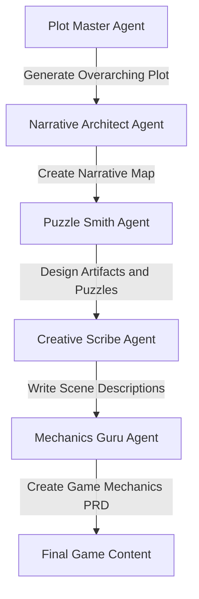
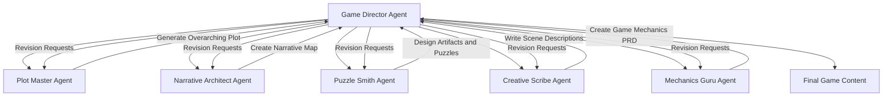
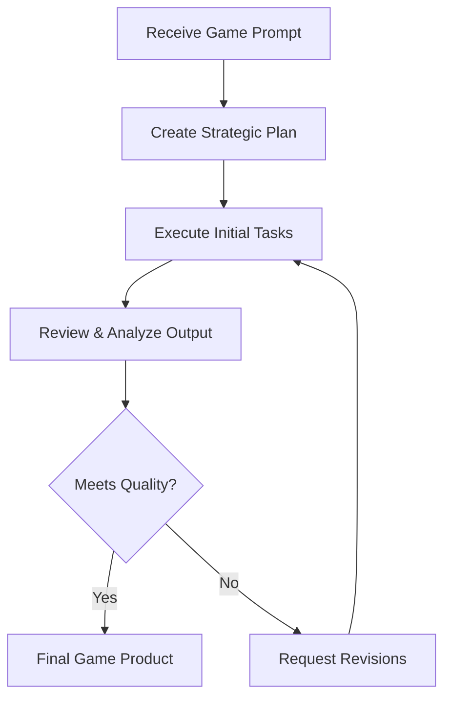
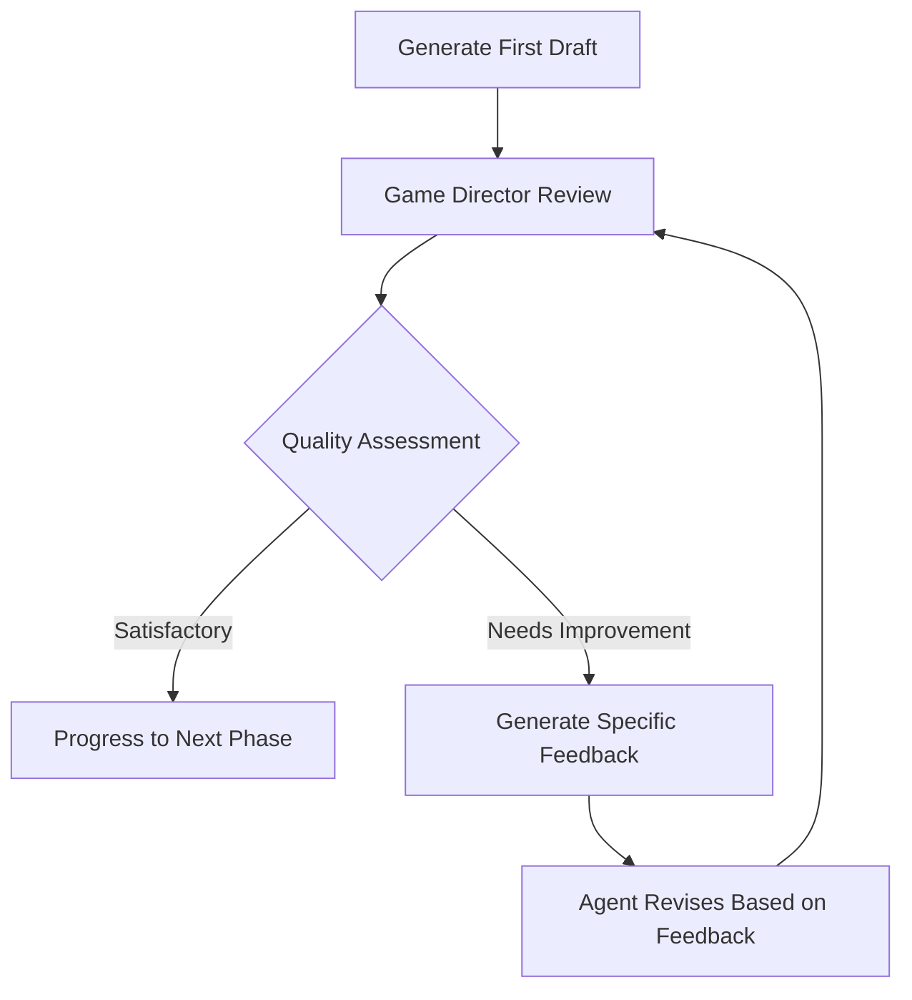
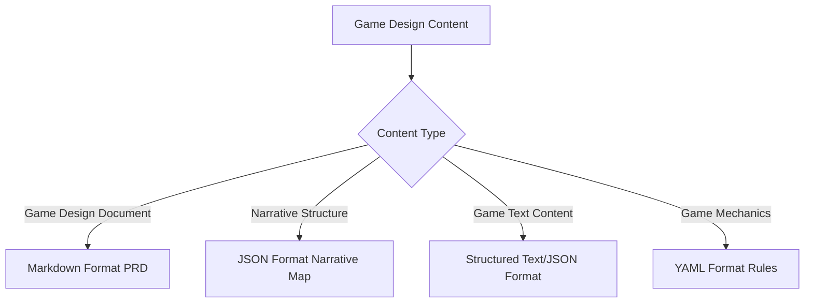

# Space Hulk Game System Improvements

## System Analysis & Enhancement Recommendations

This document contains a comprehensive analysis of the Space Hulk Game CrewAI system with prioritized improvement recommendations focused on enabling hierarchical processes, planning mechanisms, and structured output formats.

## Executive Summary

The current Space Hulk Game generation system effectively utilizes the CrewAI framework with specialized agents and sequential task execution. However, several architectural enhancements would significantly improve output quality:

1. **Hierarchical Process Flow**: Implementing a coordinator agent with hierarchical process flow
2. **Planning Capabilities**: Enabling strategic planning for improved coordination and execution
3. **Iterative Refinement**: Creating feedback loops for quality improvement
4. **Structured Output Formats**: Implementing specialized formats for different content types
5. **Error Handling & Validation**: Adding robust validation to prevent cascading failures

These improvements will transform the system from a linear content generator into an iterative content refinement engine capable of producing higher quality, more coherent game experiences.

## Current Architecture Assessment

The current architecture has several strengths but also limitations that prevent it from achieving its full potential:



**Identified Limitations:**
1. **Error Propagation**: Pure sequential flow means errors in early stages cascade through the entire system
2. **No Feedback Loops**: Agents cannot request revisions or improvements based on later work
3. **Limited Planning**: No strategic planning mechanism for agents to create execution plans
4. **No Iteration**: System lacks mechanisms to refine and improve the content through multiple passes
5. **Flat Structure**: All agents exist at the same hierarchical level without coordination
6. **Output Format Limitations**: All content is generated in the same format, not optimized for different components

## Proposed Architecture Improvements

### 1. Implement Hierarchical Structure



This hierarchical structure adds a new "Game Director Agent" that:
- Manages the overall game creation process
- Coordinates between specialized agents
- Evaluates outputs and requests revisions
- Ensures consistency across all game components
- Makes decisions when conflicts arise between different aspects of the game

### 2. Enable Planning Capabilities



Planning capabilities will allow the system to:
- Develop execution strategies before starting work
- Break complex tasks into manageable sub-tasks
- Anticipate potential issues and prepare alternatives
- Adapt the plan based on output quality and feedback
- Create iterative cycles for continuous improvement

### 3. Implement Iterative Refinement Process



This iterative process ensures:
- Multiple drafts are generated and refined
- Feedback is specific and actionable
- Quality improves through successive iterations
- Each component meets quality thresholds before proceeding

### 4. Standardize Output Formats



Specialized output formats will:
- Represent different content types in optimal formats
- Facilitate integration with game engines and tools
- Improve readability and usability of each component
- Enable automated validation of structure and completeness

## Specific Implementation Recommendations

### 1. Code & Configuration Changes

1. **Update Crew Definition**:
```python
@crew
def crew(self) -> Crew:
    return Crew(
        agents=self.agents,    
        tasks=self.tasks,      
        process=Process.hierarchical,  # Change from sequential to hierarchical
        planning=True,                 # Enable planning capabilities
        verbose=True
    )
```

2. **Add Game Director Agent** to agents.yaml:
```yaml
GameDirectorAgent:
  role: "Game Director"
  goal: "Coordinate agent efforts, ensure consistency, and drive iterative improvements"
  description: "Oversees the entire game creation process and ensures high quality output"
  backstory: >
    A visionary director with extensive experience managing complex game
    development projects. Excels at coordinating specialized teams,
    identifying areas for improvement, and driving iterative refinement
    until the final product exceeds expectations.
```

3. **Implement Memory Mechanism** to track agent interactions:
```python
# Add shared memory to retain context across iterations
shared_memory = SharedMemory()

@agent
def game_director_agent(self) -> Agent:
    return Agent(
        config=self.agents_config["GameDirectorAgent"],
        memory=shared_memory,
        verbose=True
    )
```

4. **Add Review Tasks** to tasks.yaml:
```yaml
EvaluateAndReviseGameContent:
  name: "Evaluate and Revise Game Content"
  description: >
    Review all generated game content including plot, narrative map, puzzles, 
    scene descriptions, and mechanics. Identify any inconsistencies, quality issues,
    or opportunities for enhancement. Provide specific feedback and coordinate 
    revisions from specialized agents.
  expected_output: >
    A comprehensive evaluation report with specific revision requests for each
    component, ensuring cohesive, engaging, and high-quality game content.
  agent: "GameDirectorAgent"
  context:
    - "CreateGameMechanicsPRD"
  dependencies:
    - "CreateGameMechanicsPRD"
```

### 2. Enhance Error Handling & Validation

1. **Add input/output validation hooks**:
```python
@before_task
def validate_task_input(self, task, input_data):
    """Validate that input data meets requirements for the task"""
    # Validation logic
    return validated_input

@after_task
def validate_task_output(self, task, output_data):
    """Validate that output data is complete and well-formed"""
    # Validation logic
    return validated_output
```

2. **Implement proper error handling**:
```python
try:
    task_result = task.execute()
except Exception as e:
    # Log error details
    recovery_result = self.handle_task_failure(task, e)
    # Either retry, skip, or substitute alternative
```

### 3. Standardize Output Formats

1. **Update Task Outputs in tasks.yaml**:

```yaml
CreateNarrativeMap:
  # Original content...
  expected_output: >
    A structured JSON narrative_map that clearly defines all scenes, connections,
    NPCs, items, and choice paths in a format ready for game engine integration.
  output_format: "json"  # New field to specify output format
  output_schema: "schemas/narrative_map_schema.json"  # Reference to JSON schema for validation
```

2. **Define Output Formats for Each Component**:

| Component | Format | Justification |
|-----------|--------|---------------|
| Game PRD | Markdown | Human-readable documentation format |
| Narrative Map | JSON | Structured representation of scenes, NPCs, and paths |
| Puzzles/Artifacts | JSON | Well-defined object structure with properties |
| Scene Descriptions | JSON with HTML | Rich text formatting with structured metadata |
| Dialogue | JSON | Supports branching conversation trees |
| Game Mechanics | YAML | Concise representation of rules and systems |

3. **Add Output Format Processing**:

```python
@after_kickoff
def process_output(self, output):
    """Process and format the output based on the content type"""
    formatted_outputs = {}
    
    # Process narrative map to JSON
    narrative_map = self.format_as_json(output.get("narrative_map"))
    formatted_outputs["narrative_map.json"] = narrative_map
    
    # Process scene descriptions to structured format
    scene_texts = self.format_scene_texts(output.get("scene_texts"))
    formatted_outputs["scene_texts.json"] = scene_texts
    
    # Keep PRD in markdown format
    formatted_outputs["game_prd.md"] = output.get("prd_document")
    
    return formatted_outputs
```

## Implementation Roadmap

### Phase 1: Syntax & Bug Fixes
- Review and fix any YAML syntax issues
- Add input/output validation for each task
- Implement error handling and recovery mechanisms
- Test with simple game prompts to verify basic functionality

### Phase 2: Hierarchical Structure
- Add Game Director Agent definition
- Convert process flow from sequential to hierarchical
- Implement necessary communication patterns
- Add revision request and feedback mechanisms

### Phase 3: Planning Integration
- Enable planning capability in the crew
- Implement custom planning functions
- Add metrics for evaluating output quality
- Create planning templates for different game types

### Phase 4: Output Format Standardization
- Define schemas for each output type
- Implement format conversion functions
- Create validation tools for each format
- Update tasks to produce correctly formatted outputs

### Phase 5: Iteration Mechanism
- Implement shared memory for tracking iterations
- Add evaluation tasks after each major component
- Create hooks for quality thresholds and revision triggers
- Develop version control for tracking content evolution

## Priority Enhancement Areas (Ranked)

1. **Critical: Process Flow Enhancement** - Switch to hierarchical process and enable planning
2. **Critical: Output Format Standardization** - Implement specialized formats for different content types
3. **High: Game Director Agent** - Add a coordinator agent to manage the process
4. **High: Error Handling** - Implement robust error handling to prevent cascading failures
5. **Medium: Feedback Mechanisms** - Add specific feedback generation for iterative improvement
6. **Medium: Shared Memory** - Implement context retention across iterations
7. **Low: Tool Integration** - Add specialized tools for game content validation and analysis

## Expected Benefits

The implementation of these improvements will result in:

1. **Higher Quality Output**: Through iterative refinement and specialized agent roles
2. **More Cohesive Game Design**: From coordination and consistency checking
3. **Better Structured Content**: With specialized formats for different components
4. **Improved Resilience**: Through error handling and recovery mechanisms
5. **Iterative Enhancement**: Via feedback loops and revision capabilities
6. **Clearer Development Process**: With planning and coordinated execution

This enhanced architecture transforms the Space Hulk Game system from a linear content generator into a sophisticated content creation and refinement engine capable of producing higher quality, more coherent, and better structured game experiences.