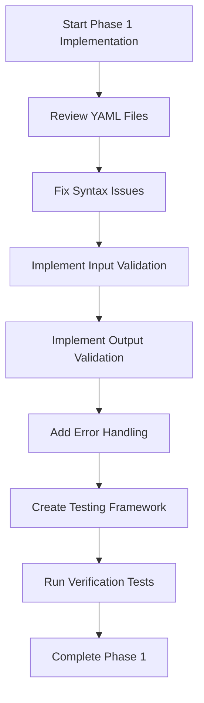

# Phase 1 Implementation Plan: Syntax & Bug Fixes

## Overview

Phase 1 focuses on foundational improvements to the Space Hulk Game's CrewAI implementation, specifically addressing syntax issues, adding validation, and implementing error handling mechanisms. This phase establishes a solid foundation for the more advanced architectural changes in subsequent phases.

## Implementation Goals

1. Review and fix any YAML syntax issues in configuration files
2. Add input/output validation for each task
3. Implement error handling and recovery mechanisms
4. Test with simple game prompts to verify basic functionality

## Detailed Implementation Plan



### 1. YAML Syntax Review & Fixes

**Files to Review:**
- `src/space_hulk_game/config/agents.yaml`
- `src/space_hulk_game/config/tasks.yaml`
- `src/space_hulk_game/config/gamedesign.yaml`

**Potential Issues to Address:**
- Inconsistent indentation
- Missing required fields
- Improper formatting of multi-line strings
- Inconsistent use of quotes
- Invalid YAML syntax

**Implementation Approach:**
- Use a YAML validator to check for syntax errors
- Standardize indentation (2 spaces)
- Ensure consistent formatting for multi-line strings
- Verify all required fields are present for each agent and task

### 2. Input Validation Implementation

**Validation Hooks:**
```python
@before_kickoff
def prepare_inputs(self, inputs):
    """
    Hook method that validates inputs before the crew starts.
    """
    try:
        # Validate required inputs
        if "prompt" not in inputs:
            raise ValueError("Input must contain a 'prompt' key")

        # Process inputs
        inputs["additional_data"] = "Some extra information for the first task."
        return inputs
    except Exception as e:
        # Log error and provide recovery mechanism
        print(f"Error in prepare_inputs: {str(e)}")
        # Set default values if possible
        inputs["prompt"] = inputs.get("prompt", "Default space hulk exploration scenario")
        return inputs
```

**Task Input Validation:**
```python
@before_task
def validate_task_input(self, task, input_data):
    """Validate that input data meets requirements for the task"""
    try:
        # Validation logic based on task type
        if task.name == "Generate Overarching Plot":
            if "prompt" not in input_data:
                raise ValueError("Missing required 'prompt' in input data")
        elif task.name == "Create Narrative Map":
            if "plot_outline" not in input_data:
                raise ValueError("Missing required 'plot_outline' in input data")
        # Add more task-specific validation as needed

        return input_data  # Return validated input
    except Exception as e:
        # Log error
        print(f"Validation error for task {task.name}: {str(e)}")
        # Return original input or provide default values
        return input_data
```

### 3. Output Validation Implementation

**Task Output Validation:**
```python
@after_task
def validate_task_output(self, task, output_data):
    """Validate that output data is complete and well-formed"""
    try:
        # Validation logic based on task type
        if task.name == "Generate Overarching Plot":
            if "plot_outline" not in output_data:
                raise ValueError("Missing required 'plot_outline' in output data")
        elif task.name == "Create Narrative Map":
            if "narrative_tree" not in output_data:
                raise ValueError("Missing required 'narrative_tree' in output data")
        # Add more task-specific validation as needed

        return output_data  # Return validated output
    except Exception as e:
        # Log error
        print(f"Output validation error for task {task.name}: {str(e)}")
        # Return original output
        return output_data
```

### 4. Error Handling Implementation

**Core Error Handling:**
```python
def handle_task_failure(self, task, exception):
    """Handle task execution failures with appropriate recovery mechanisms"""
    error_message = f"Error executing task '{task.name}': {str(exception)}"
    print(error_message)

    # Task-specific recovery mechanisms
    if task.name == "Generate Overarching Plot":
        # Return a basic default plot outline
        return {
            "plot_outline": {
                "title": "Default Space Hulk Adventure",
                "setting": "Derelict space vessel",
                "main_branches": [
                    {"path": "Exploration", "description": "Explore the vessel cautiously"},
                    {"path": "Combat", "description": "Fight through hostile entities"}
                ],
                "endings": [
                    {"name": "Escape", "description": "Successfully escape the vessel"},
                    {"name": "Trapped", "description": "Become trapped in the vessel"}
                ]
            }
        }
    # Add more task-specific recovery mechanisms

    # Default fallback
    return {"error": error_message, "recovered": False}
```

**Implementation in Task Execution:**
```python
try:
    task_result = task.execute()
except Exception as e:
    task_result = self.handle_task_failure(task, e)
```

### 5. Testing Framework

**Test Cases:**
- Basic input validation with valid prompt
- Basic input validation with missing prompt
- Task validation with missing required input
- Task validation with valid input
- Error recovery for each task type
- End-to-end execution with simple prompt

**Test Implementation:**
```python
def test_basic_functionality():
    """Test the basic functionality of the Space Hulk Game crew"""
    game = SpaceHulkGame()
    result = game.kickoff({"prompt": "A simple space hulk exploration scenario"})
    assert result is not None
    assert "error" not in result

def test_input_validation():
    """Test input validation with missing prompt"""
    game = SpaceHulkGame()
    result = game.kickoff({})
    assert result is not None  # Should recover with default values

def test_error_recovery():
    """Test error recovery mechanisms"""
    # Intentionally cause an error and verify recovery
    game = SpaceHulkGame()
    # Test implementation here
```

## Expected Outcomes

After implementing Phase 1:

1. Configuration files will have consistent, valid YAML syntax
2. Input validation will prevent invalid or incomplete data from entering the system
3. Output validation will ensure task outputs meet expected formats
4. Error handling will prevent cascading failures and provide recovery mechanisms
5. Basic testing will verify the system functions correctly with simple inputs

## Next Steps

Upon successful completion of Phase 1, we will be ready to proceed to Phase 2: Hierarchical Structure implementation, which will focus on:

1. Adding the Game Director Agent
2. Converting process flow from sequential to hierarchical
3. Implementing necessary communication patterns
4. Adding revision request and feedback mechanisms

## Additional Considerations

- These changes maintain backward compatibility with the existing system
- Documentation updates should reflect the enhanced validation and error handling
- These improvements lay the groundwork for more advanced features in later phases
