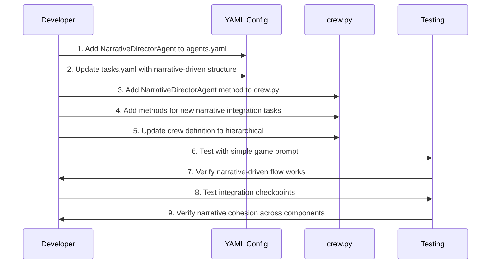

# Phase 2 Implementation Plan: Narrative-Driven Hierarchical Structure

## Overview

Phase 2 transforms the Space Hulk Game CrewAI implementation from a linear flow to a narrative-driven hierarchical structure. This architectural enhancement ensures that narrative cohesion drives all aspects of development, with clear sequential dependencies between specialists and regular integration checkpoints.

## Implementation Goals

1. Establish a Narrative Director Agent (formerly Game Director) to coordinate the narrative-driven process
2. Create strict sequential dependencies to ensure narrative foundations before specialized development
3. Implement continuous collaboration through context-specific directives
4. Add integration checkpoints to validate all elements against narrative requirements
5. Convert process flow from sequential to hierarchical using existing CrewAI mechanisms

## Development Hierarchy & Workflow

```mermaid
graph TD
    Start[Game Prompt] --> ND[Narrative Director Agent]

    %% Plot Master Foundation Work
    ND -->|Assign Initial Task| PM[Plot Master Agent]
    PM -->|Create Comprehensive Plot Foundation| ND
    ND -->|Evaluate| E1[Evaluate Narrative Foundation]
    E1 -->|Feedback & Approval| PM
    PM -->|Refine Foundation| ND

    %% Narrative Structure Development
    ND -->|Assign After Plot Approval| NA[Narrative Architect Agent]
    NA -->|Develop Detailed Narrative Structure| ND
    ND -->|Evaluate| E2[Evaluate Narrative Structure]
    E2 -->|Feedback & Approval| NA
    NA -->|Refine Structure| ND

    %% Specialized Work - Only after narrative structure approval
    ND -->|Provide Narrative Context| PS[Puzzle Smith Agent]
    PS -->|Create Context-Integrated Puzzles| ND
    ND -->|Evaluate Against Narrative| E3[Narrative Integration Check: Puzzles]
    E3 -->|Feedback| PS
    PS -->|Revise For Narrative Cohesion| ND

    ND -->|Provide Narrative Context| CS[Creative Scribe Agent]
    CS -->|Write Narrative-Driven Scenes| ND
    ND -->|Evaluate Against Narrative| E4[Narrative Integration Check: Scenes]
    E4 -->|Feedback| CS
    CS -->|Revise For Narrative Cohesion| ND

    ND -->|Provide Narrative Context| MG[Mechanics Guru Agent]
    MG -->|Design Narrative-Supporting Mechanics| ND
    ND -->|Evaluate Against Narrative| E5[Narrative Integration Check: Mechanics]
    E5 -->|Feedback| MG
    MG -->|Revise For Narrative Cohesion| ND

    %% Final Integration
    ND -->|Comprehensive Integration| FI[Final Narrative Integration]
    FI --> End[Cohesive Narrative-Driven Game Content]
```



## Detailed Implementation Plan

### 1. Narrative Director Agent Definition

The Narrative Director Agent will ensure narrative cohesion across all game elements, serving as the central authority for the narrative-driven development process.

**YAML Configuration for agents.yaml:**

```yaml
NarrativeDirectorAgent:
  role: "Narrative Director"
  goal: "Ensure narrative cohesion and thematic consistency across all game elements through a structured development process driven by strong narrative foundations."
  description: "The Narrative Director oversees the entire game creation workflow, maintaining narrative as the central pillar of development. They coordinate the efforts of specialized agents, provide context-specific directives, and verify all elements align with the established narrative framework."
  backstory: >
    A master storyteller with extensive experience directing narrative-driven game development.
    Having crafted numerous critically acclaimed interactive narratives, the Narrative Director
    understands how to weave gameplay mechanics, environmental storytelling, character development,
    and player agency into a cohesive whole. Their expertise lies in maintaining the integrity of the
    narrative vision throughout all aspects of development, ensuring that every puzzle, scene,
    and game mechanic serves the overarching story in meaningful ways. They excel at guiding
    specialized teams toward creating experiences where narrative and gameplay are seamlessly integrated.
  tools: []
  allow_delegation: True
  verbose: True
```

### 2. Restructured Task Dependencies

Modify the existing tasks and add new ones to enforce strict sequential dependencies:

```yaml
# Initial narrative foundation - must be completed and approved first
GenerateOverarchingPlot:
  name: "Generate Comprehensive Narrative Foundation"
  description: >
    Create a comprehensive narrative foundation for the Space Hulk game. This foundation must be
    detailed enough to guide all subsequent development, establishing the setting, key plot points,
    themes, tone, and central conflicts. This narrative foundation is the critical first step that
    all other development will build upon.
  expected_output: >
    A detailed narrative foundation document that clearly defines the game's setting, core
    narrative themes, major plot points, key characters, central conflicts, and narrative
    tone. This document must be comprehensive enough to serve as the guiding framework for
    all subsequent development work.
  agent: "PlotMasterAgent"

EvaluateNarrativeFoundation:
  name: "Evaluate Narrative Foundation"
  description: >
    Thoroughly evaluate the narrative foundation to ensure it provides sufficient depth, clarity,
    and direction for all subsequent development. This is a critical quality gate - subsequent
    work cannot proceed until a strong narrative foundation is established.
  expected_output: >
    A comprehensive evaluation of the narrative foundation with specific feedback for improvement.
    Include explicit approval or revision requests. Only when approved can development proceed
    to the next phase.
  agent: "NarrativeDirectorAgent"
  context:
    - "GenerateOverarchingPlot"
  dependencies:
    - "GenerateOverarchingPlot"

# Narrative structure - can only proceed after foundation approval
CreateNarrativeMap:
  name: "Develop Detailed Narrative Structure"
  description: >
    Based on the approved narrative foundation, develop a detailed narrative map that defines
    all critical paths, character arcs, decision points, and narrative progression. This
    structure will direct all subsequent content creation by specialists.
  expected_output: >
    A comprehensive narrative structure that clearly defines all scenes, connections, character
    moments, key decision points, and narrative progression in a structured format that can
    guide specialized development work.
  agent: "NarrativeArchitectAgent"
  context:
    - "GenerateOverarchingPlot"
    - "EvaluateNarrativeFoundation"
  dependencies:
    - "EvaluateNarrativeFoundation"

EvaluateNarrativeStructure:
  name: "Evaluate Narrative Structure"
  description: >
    Thoroughly evaluate the narrative structure to ensure it adequately develops the approved
    foundation into an implementable blueprint for all specialized development. This is a
    critical quality gate - specialist work cannot fully proceed until the narrative structure
    is approved.
  expected_output: >
    A detailed evaluation of the narrative structure with specific feedback. Include explicit
    approval or revision requests. Only when approved can specialist development fully proceed.
  agent: "NarrativeDirectorAgent"
  context:
    - "CreateNarrativeMap"
    - "GenerateOverarchingPlot"
  dependencies:
    - "CreateNarrativeMap"

# Specialized tasks - can only begin meaningful work after narrative structure approval
DesignArtifactsAndPuzzles:
  name: "Create Narrative-Integrated Puzzles and Artifacts"
  description: >
    Based on the approved narrative structure, design puzzles, artifacts, monsters, and NPCs
    that directly serve and enhance the established narrative. Each element must have clear
    connections to the narrative themes, advance the story in meaningful ways, and maintain
    thematic consistency.
  expected_output: >
    A collection of puzzle, artifact, monster, and NPC designs that are tightly integrated
    with the narrative. Each design must include explicit explanations of how it connects to
    and advances the established narrative.
  agent: "PuzzleSmithAgent"
  context:
    - "CreateNarrativeMap"
    - "EvaluateNarrativeStructure"
    - "GenerateOverarchingPlot"
  dependencies:
    - "EvaluateNarrativeStructure"

NarrativeIntegrationCheckPuzzles:
  name: "Narrative Integration Check: Puzzles"
  description: >
    Evaluate how well the puzzles, artifacts, monsters, and NPCs integrate with and
    advance the established narrative. Ensure each element serves the narrative purpose
    defined in the structure and maintains thematic consistency.
  expected_output: >
    A detailed assessment of narrative integration for each puzzle element with specific
    feedback for improving narrative cohesion where needed.
  agent: "NarrativeDirectorAgent"
  context:
    - "DesignArtifactsAndPuzzles"
    - "CreateNarrativeMap"
  dependencies:
    - "DesignArtifactsAndPuzzles"

WriteSceneDescriptionsAndDialogue:
  name: "Write Narrative-Driven Scene Descriptions"
  description: >
    Based on the approved narrative structure, write scene descriptions and dialogue
    that bring the narrative to life. Each scene must accurately reflect its place in
    the narrative structure, advance the story appropriately, and maintain consistent
    tone and themes.
  expected_output: >
    A collection of scene descriptions and dialogue that effectively translate the
    narrative structure into vivid, engaging content. Each scene must explicitly
    connect to its place in the narrative structure.
  agent: "CreativeScribeAgent"
  context:
    - "CreateNarrativeMap"
    - "EvaluateNarrativeStructure"
    - "GenerateOverarchingPlot"
  dependencies:
    - "EvaluateNarrativeStructure"

NarrativeIntegrationCheckScenes:
  name: "Narrative Integration Check: Scenes"
  description: >
    Evaluate how well the scene descriptions and dialogue reflect and advance the
    established narrative. Ensure the writing effectively communicates the narrative
    moments defined in the structure and maintains consistent tone and themes.
  expected_output: >
    A detailed assessment of narrative integration for each scene with specific
    feedback for improving narrative effectiveness where needed.
  agent: "NarrativeDirectorAgent"
  context:
    - "WriteSceneDescriptionsAndDialogue"
    - "CreateNarrativeMap"
  dependencies:
    - "WriteSceneDescriptionsAndDialogue"

CreateGameMechanicsPRD:
  name: "Design Narrative-Supporting Mechanics"
  description: >
    Based on the approved narrative structure, design game mechanics that directly
    support and enhance the narrative experience. Each mechanic must have a clear
    narrative purpose, enabling player engagement with the story in meaningful ways.
  expected_output: >
    A comprehensive game mechanics design document where each mechanic explicitly
    connects to and supports narrative elements. Include explanations of how
    each mechanic serves the narrative purpose.
  agent: "MechanicsGuruAgent"
  context:
    - "CreateNarrativeMap"
    - "EvaluateNarrativeStructure"
    - "GenerateOverarchingPlot"
  dependencies:
    - "EvaluateNarrativeStructure"

NarrativeIntegrationCheckMechanics:
  name: "Narrative Integration Check: Mechanics"
  description: >
    Evaluate how well the game mechanics support and enhance the established narrative.
    Ensure each mechanic serves a clear narrative purpose and enables meaningful
    player engagement with the story elements.
  expected_output: >
    A detailed assessment of narrative integration for each game mechanic with specific
    feedback for improving narrative alignment where needed.
  agent: "NarrativeDirectorAgent"
  context:
    - "CreateGameMechanicsPRD"
    - "CreateNarrativeMap"
  dependencies:
    - "CreateGameMechanicsPRD"

# Final integration checkpoint
FinalNarrativeIntegration:
  name: "Final Narrative Integration"
  description: >
    Perform a comprehensive review of all game elements together to ensure they form
    a cohesive, narrative-driven whole. Identify any inconsistencies across elements
    and ensure the complete experience maintains narrative integrity throughout the
    player journey.
  expected_output: >
    A final integration report that confirms narrative cohesion across all elements.
    Include any adjustments needed to ensure the complete game experience delivers
    a consistent, engaging narrative journey.
  agent: "NarrativeDirectorAgent"
  context:
    - "NarrativeIntegrationCheckPuzzles"
    - "NarrativeIntegrationCheckScenes"
    - "NarrativeIntegrationCheckMechanics"
  dependencies:
    - "NarrativeIntegrationCheckPuzzles"
    - "NarrativeIntegrationCheckScenes"
    - "NarrativeIntegrationCheckMechanics"
```

### 3. Add Corresponding Methods to crew.py

Add methods for the Narrative Director Agent and all new evaluation tasks:

```python
@agent
def NarrativeDirectorAgent(self) -> Agent:
    """
    Returns the NarrativeDirectorAgent definition from agents.yaml.

    This agent ensures narrative cohesion across all game elements and
    coordinates the narrative-driven development process.
    """
    logger.info(f"Creating NarrativeDirectorAgent with config: {self.agents_config.get('NarrativeDirectorAgent')}")
    return Agent(
        config=self.agents_config["NarrativeDirectorAgent"],
        verbose=True
    )

@task
def EvaluateNarrativeFoundation(self) -> Task:
    """
    The EvaluateNarrativeFoundation task from tasks.yaml.
    """
    logger.info(f"Creating EvaluateNarrativeFoundation task with config: {self.tasks_config.get('EvaluateNarrativeFoundation')}")
    return Task(
        config=self.tasks_config["EvaluateNarrativeFoundation"]
    )

@task
def EvaluateNarrativeStructure(self) -> Task:
    """
    The EvaluateNarrativeStructure task from tasks.yaml.
    """
    logger.info(f"Creating EvaluateNarrativeStructure task with config: {self.tasks_config.get('EvaluateNarrativeStructure')}")
    return Task(
        config=self.tasks_config["EvaluateNarrativeStructure"]
    )

@task
def NarrativeIntegrationCheckPuzzles(self) -> Task:
    """
    The NarrativeIntegrationCheckPuzzles task from tasks.yaml.
    """
    logger.info(f"Creating NarrativeIntegrationCheckPuzzles task with config: {self.tasks_config.get('NarrativeIntegrationCheckPuzzles')}")
    return Task(
        config=self.tasks_config["NarrativeIntegrationCheckPuzzles"]
    )

@task
def NarrativeIntegrationCheckScenes(self) -> Task:
    """
    The NarrativeIntegrationCheckScenes task from tasks.yaml.
    """
    logger.info(f"Creating NarrativeIntegrationCheckScenes task with config: {self.tasks_config.get('NarrativeIntegrationCheckScenes')}")
    return Task(
        config=self.tasks_config["NarrativeIntegrationCheckScenes"]
    )

@task
def NarrativeIntegrationCheckMechanics(self) -> Task:
    """
    The NarrativeIntegrationCheckMechanics task from tasks.yaml.
    """
    logger.info(f"Creating NarrativeIntegrationCheckMechanics task with config: {self.tasks_config.get('NarrativeIntegrationCheckMechanics')}")
    return Task(
        config=self.tasks_config["NarrativeIntegrationCheckMechanics"]
    )

@task
def FinalNarrativeIntegration(self) -> Task:
    """
    The FinalNarrativeIntegration task from tasks.yaml.
    """
    logger.info(f"Creating FinalNarrativeIntegration task with config: {self.tasks_config.get('FinalNarrativeIntegration')}")
    return Task(
        config=self.tasks_config["FinalNarrativeIntegration"]
    )
```

### 4. Update Crew Definition to Hierarchical

Update the crew method to use hierarchical process flow with the Narrative Director as the manager:

```python
@crew
def crew(self) -> Crew:
    """
    Returns an instance of the Crew with a hierarchical process flow.
    The Narrative Director Agent manages the narrative-driven development process.
    """
    return Crew(
        agents=self.agents,    # collected automatically by @agent decorators
        tasks=self.tasks,      # collected automatically by @task decorators
        process=Process.hierarchical,  # Use hierarchical process
        verbose=True
    )
```

## Implementation Sequence



## Testing Plan

1. **Narrative Foundation Test**:
   - Verify that the Plot Master Agent creates a comprehensive narrative foundation
   - Confirm the Narrative Director properly evaluates the foundation
   - Test the quality gate to ensure development doesn't proceed without approval

2. **Narrative Structure Test**:
   - Verify that the Narrative Architect develops a detailed structure based on the approved foundation
   - Confirm the Narrative Director properly evaluates the structure
   - Test the quality gate to ensure specialist work doesn't fully proceed without approval

3. **Integration Checkpoint Tests**:
   - Verify that each specialist creates content clearly connected to the narrative
   - Confirm the Narrative Director performs effective integration checks
   - Test that feedback leads to improved narrative cohesion

4. **End-to-End Test**:
   - Run a complete game generation process with the narrative-driven approach
   - Verify all components maintain narrative cohesion throughout
   - Confirm the final product delivers a consistent narrative experience

## Expected Outcomes

After implementing Phase 2:

1. The system will enforce narrative as the central pillar driving all development
2. Clear sequential dependencies will ensure proper foundations before specialized work
3. Integration checkpoints will maintain narrative cohesion across all game elements
4. The quality of the narrative experience will improve through enforced consistency
5. Players will experience a more cohesive, thematically consistent game

## Next Steps

Upon successful completion of Phase 2, we will be ready to proceed to Phase 3: Planning Integration, which will enhance the system's ability to develop strategic plans while maintaining the narrative-driven approach.

## Additional Considerations

- This implementation uses only existing CrewAI mechanisms (hierarchical process, task dependencies)
- The task dependency structure enforces the narrative-driven development approach
- The strict quality gates ensure proper foundations before specialized development
- The revised task descriptions provide context-specific directives to specialists
- Regular integration checkpoints validate all elements against narrative requirements
